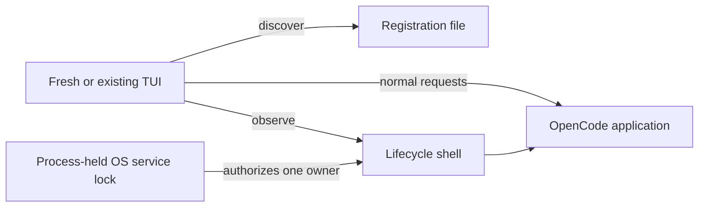
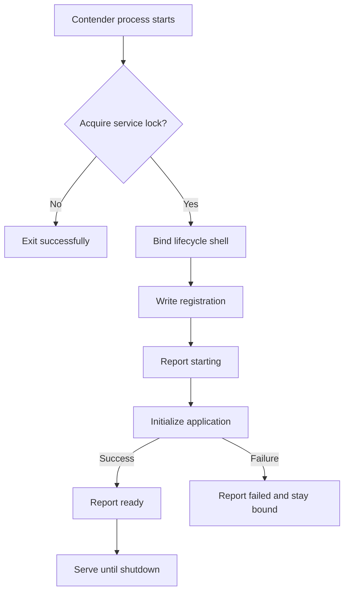

# Service Lifecycle: Election, Restart, and Reconnect

Status: in progress

Incident: [#36688](https://github.com/anomalyco/opencode/issues/36688)

## Summary

The managed V2 service keeps its current update policy: the background updater
may install a new package, but only a freshly launched TUI activates that update
after finding an older running service. Existing TUIs never replace a service;
they only reconnect.

The restart path changes in three places:

1. A process-held OS lock, not the HTTP port or registration file, elects
   exactly one server owner for its lifetime.
2. The elected process binds and registers a minimal lifecycle surface before
   it initializes the application, so clients can distinguish a slow winner
   from an absent server.
3. TUIs rediscover and reconnect indefinitely. Transport loss is never a
   terminal error by itself.

Several clients may spawn small contenders during a restart. This is safe and
intentional: one contender acquires the lock and initializes, while every loser
exits before expensive server boot. The design does not require clients to
agree on a single initiator.

This proposal does not introduce a supervisor process, warm candidate server,
protocol negotiation, idle background restart, or general execution-recovery
framework.

## Implementation Status

| Area                      | State                                                                 |
| ------------------------- | --------------------------------------------------------------------- |
| Lifetime ownership        | Implemented on this branch with a scoped OS lock                      |
| Contender behavior        | Implemented; losers exit before the server module is imported         |
| Registration repair       | Implemented; the owner reasserts deleted or corrupt discovery         |
| Channel isolation         | Implemented with no-clobber migration for legacy preview discovery    |
| Client startup waiting    | Implemented; slow winners are not killed and waiting is indefinite    |
| Lifecycle shell           | Implemented; the owner binds and registers before application boot    |
| Failed-state latching     | Implemented; deterministic boot failure stays bound and actionable    |
| Recovery diagnostics      | Implemented; the TUI shows status instead of transport internals      |
| Cross-platform validation | macOS runtime verified; Linux and Windows run in the unit-test matrix |

## Context

The V2 CLI runs a shared managed service that owns Sessions, location graphs,
plugins, permissions, and tool execution. The service updater can replace the
installed package while the current process continues running the old image.
A later TUI launch then detects the version mismatch and replaces the service.

Incident #36688 showed four failures in that replacement path:

- Multiple TUIs spawned heavyweight server contenders.
- A winner remained unobservable while it cold-booted, so another wave treated
  it as absent and displaced it.
- A fresh TUI exhausted its reconnect budget and crashed with an unhandled
  transport defect.
- A losing contender remained alive and consumed about 1 GB of RSS.

The `origin/v2` baseline serializes service startup with `EffectFlock`. A
contender acquires a three-second heartbeat lease, checks whether another
service became discoverable, and only the winner crosses the application-boot
boundary. This already prevents simultaneous heavy boots and makes startup
losers exit.

The lease is released immediately after registration, however, so it is not
lifetime ownership. Registration then reverts to last-writer-wins authority: a
deleted or corrupt registration can admit a second boot, a displaced server
terminates itself through its 10-second registration self-check, and a stalled
lease holder can be displaced after the three-second service staleness timeout.

`Flock` and `EffectFlock` live in `packages/core/src/util` and are also used for
config writes, MCP auth, npm installs, and repository caching. Despite the
name, the primitive is an atomic-mkdir lease with heartbeat and staleness
takeover, not an OS-held lock. It remains appropriate for bounded critical
sections, including today's startup fence, but is not lifetime service
ownership.

The current implementation also mixes three different concepts:

- **Ownership:** which process is allowed to be the managed server.
- **Discovery:** where clients can reach that process.
- **Lifecycle:** whether that process is starting, ready, stopping, or failed.

This design gives each concept one authority.

```definitions
[
  {
    "term": "Owner",
    "definition": "The one process holding the process-held OS service lock."
  },
  {
    "term": "Contender",
    "definition": "A small serve process attempting to acquire the service lock. It must not initialize the application before winning."
  },
  {
    "term": "Registration",
    "definition": "An atomic discovery record containing the elected owner's identity and endpoint. Registration never grants ownership."
  },
  {
    "term": "Lifecycle shell",
    "definition": "The minimal HTTP surface bound by the elected process before application initialization. It serves health and retryable startup responses."
  },
  {
    "term": "Application",
    "definition": "The full server routes and global or location-scoped modules used for normal OpenCode work."
  }
]
```

## Goals

- At most one process initializes and serves the managed application.
- Losing contenders exit before database, route, plugin, MCP, or location boot.
- A slow winner becomes observable before expensive initialization.
- Existing and freshly launched TUIs survive retryable service unavailability.
- Reconnect follows service state instead of displaying retry counts or raw
  transport failures.
- Version-mismatch replacement remains triggered by a fresh TUI launch.
- A stale or malformed registration cannot create a second owner.
- An unresponsive owner is never killed automatically by an arbitrary TUI.
- Every spawned contender has a bounded path to ownership or exit.

## Non-goals

- Restarting automatically when a background update finds an idle window.
- Running old and candidate application servers concurrently.
- Adding a permanent steward, proxy, or supervisor process.
- Zero-downtime worker handoff or automatic rollback.
- Application protocol negotiation or automatic TUI self-restart.
- General hard-crash recovery for active Sessions.
- Defining recovery semantics for provider attempts, tools, shells, sub-agents,
  permissions, questions, or background jobs.
- Automatically killing a frozen owner.
- Bounding concurrent location cold boots after clients reconnect.
- Multi-machine or clustered service placement.

## Invariants

1. **The service lock is ownership.** Exactly one process may hold the OS lock
   for one installation channel and service profile.
2. **Ownership precedes boot.** A contender performs no expensive application
   initialization before it acquires the lock.
3. **Ownership lasts for the process lifetime.** The owner holds an open lock
   handle until the managed server exits. The OS releases it on process death
   without a cleanup callback.
4. **The port is transport, not election.** The owner may select a dynamic port
   after acquiring the lock.
5. **Registration is discovery, not election.** Deleting, corrupting, or
   replacing registration does not invalidate a live owner's lock.
6. **Only a fresh launch enforces package version.** Existing TUIs reconnect to
   the current owner without initiating version replacement.
7. **Transport loss is retryable.** It never terminates a TUI without a separate
   diagnosed, non-retryable cause.
8. **Clients do not kill an unresponsive owner automatically.** Destructive
   recovery requires the explicit `service restart` command.
9. **Lifecycle does not promise execution semantics.** Graceful replacement
   invokes Session suspension and resumption hooks, but tool-level continuity
   belongs to a separate design.

## System Model



The lifecycle shell and application run in the same process. The distinction is
initialization order and responsibility, not process topology.

## Service Status

The server reports one small status value:

```typescript
type ServiceStatus =
  | {
      type: "starting"
    }
  | {
      type: "ready"
    }
  | {
      type: "stopping"
      targetVersion?: string
    }
  | {
      type: "failed"
      message: string
      action: string
    }
```

The client adds only the discovery states needed by callers:

```typescript
type Status = { type: "missing" } | { type: "unreachable" } | { type: "unresponsive" } | ServiceStatus
```

The health response retains the existing fields for old clients and adds the
status discriminant:

```typescript
type ServiceHealth = {
  healthy: true
  version: string
  pid: number
  instanceID: string
  status: ServiceStatus
}
```

`healthy: true` means the registered lifecycle shell is responding and its
identity matches registration. New clients use `status.type === "ready"` as
the application-readiness signal.

During `starting` or `stopping`, application requests are not held in memory.
They receive an immediate retryable response:

```http
HTTP/1.1 503 Service Unavailable
Retry-After: 1
Content-Type: application/json

{"code":"service_starting"}
```

`stopping` uses `service_stopping`. A failed application boot uses
`service_failed` and includes a safe diagnostic message.

A failed owner remains bound and keeps holding the service lock. Exiting on
failure would let every waiting client's `ensureRunning` loop elect a new
contender that repeats the same heavy failing boot, so staying bound turns a
deterministic boot failure into one observable `failed` state instead of a
client-driven respawn loop. Recovery still works: a fresh launch observes the
failed instance through the stop path, and explicit `service restart` replaces
it.

## Registration Contract

Registration contains only discovery identity:

```typescript
type ServiceRegistration = {
  schema: 1
  instanceID: string
  version: string
  url: string
  pid: number
}
```

Authentication continues to use the existing private service credential
storage. The registration schema does not change that policy.

The owner writes registration only after the lifecycle shell has bound:

1. Bind the lifecycle shell.
2. Write a temporary registration file with mode `0600`.
3. Atomically rename it over the old registration.
4. Serve lifecycle health as `starting`.

On shutdown, the owner removes registration only if the current file still has
its `instanceID`. An old finalizer can never remove a successor's registration.

While running, the owner periodically asserts its registration. Because the
lock guarantees exactly one live owner, any registration that does not name the
owner is stale or corrupt, and the owner rewrites it. A deleted or clobbered
registration therefore heals within one assertion interval instead of leaving
clients waiting on absent discovery. This inverts today's self-check loop,
which terminates the displaced process instead of repairing discovery.

Legacy registration shapes are decoded by a compatibility adapter. The new
domain type does not make fields optional to represent old formats.

## Election

This design promotes today's startup fence into lifetime ownership.
Last-writer-wins registration is replaced by a process-held OS lock that is
acquired before any expensive boot work and held for the entire service
lifetime.

A heartbeat-and-staleness lease, including the existing `Flock` utility, is not
sufficient for service ownership: the service configures a three-second stale
timeout, after which its lock can be broken and recreated. An event-loop stall,
a suspended machine, or a debugger pause can therefore make a live owner appear
stale and allow a contender to displace it. Service ownership requires a
process-held OS lock: `flock` on Unix and an exclusively bound named pipe on
Windows. It cannot be broken because a heartbeat exceeded a timeout. Process
death releases the lock through the OS.

Neither Bun nor Node exposes `flock` directly, the existing `Flock` utility is
an mkdir-plus-heartbeat lease rather than an OS-held lock, and the common
lockfile packages are staleness-based leases as well. The platform layer uses
`bun:ffi` to call `flock` on POSIX and Node's named-pipe server support on
Windows, where Bun FFI is not available on every shipped architecture. It lives
alongside the existing utility in `packages/core/src/util`. This primitive is
the foundation of the design, so the delivery sequence spikes it first.



Lock acquisition by a contender is nonblocking or tightly bounded. A loser
must exit before constructing application routes or importing startup-heavy
modules.

Several clients may spawn contenders concurrently. The design guarantees one
heavy winner, not one process spawn. If the winner crashes during startup, the
OS releases the lock and a later client retry starts another election.

The lock is scoped by installation channel and service profile. Local, preview,
and stable installations cannot displace one another.

## Update Activation

Background update behavior remains unchanged:

1. The running service checks for an update.
2. The updater installs the package in the background.
3. The running process continues using its existing process image.
4. No idle check or automatic restart occurs.

A fresh TUI launch activates the installed update:

1. Read registration and authenticate the responding service.
2. If its package version matches the fresh client, attach normally.
3. If the version differs, request graceful stop of that exact registered
   instance using the existing authenticated stop path.
4. Re-check instance identity before every signal or escalation in that path.
5. Wait for the old process to exit and release the service lock.
6. Call `ensureRunning` until a compatible service becomes ready.

Concurrent fresh launchers may all observe the same old instance. Stopping that
exact instance must be idempotent. Once registration names a different instance,
a stale launcher stops signaling and returns to discovery.

No durable restart-transition record is introduced. The initiating fresh TUI
already knows the source and target versions and can display its update
preflight. Existing TUIs may display `Updating...` if they observed `stopping`;
otherwise `Waiting for background service...` is the honest fallback.

## Fresh Launch Versus Reconnect

Fresh launch and reconnect deliberately have different version policies:

```typescript
type ManagedConnection =
  | {
      type: "launch"
      requiredVersion: string
    }
  | {
      type: "reconnect"
    }
```

- `launch` requires the installed package version and may activate replacement.
- `reconnect` accepts the current owner and never activates replacement.

This preserves today's permissive reconnect behavior. Explicit application
protocol negotiation and automatic TUI re-exec remain follow-ups.

## Client Reconnect

Fresh and existing TUIs use the same status loop after startup:

1. Read registration on every attempt. Do not retry a stale URL indefinitely.
2. If registration is absent, call `ensureRunning` and continue waiting.
3. If registration is unreachable, call `ensureRunning`. A live owner prevents
   contenders from acquiring the lock; a dead owner does not.
4. If status is `starting` or `stopping`, wait.
5. If status is `failed`, show its actionable message.
6. If status is `ready`, rebuild HTTP and event-stream clients for the new
   endpoint and perform authoritative state reconciliation.

Retry cadence is internal policy. Retry counts are telemetry, not user-facing
state. The TUI waits until the service is ready or the user exits.

Transport failures are handled at the TUI run boundary. A raw client transport
error or Effect defect must not escape to the terminal. Hard exit is reserved
for diagnosed causes such as invalid local configuration, failed authentication,
or a foreign process occupying an explicitly configured port.

The UI derives text from status:

| Status                   | User-facing state                   |
| ------------------------ | ----------------------------------- |
| No registration          | `Starting background service...`    |
| Registration unreachable | `Waiting for background service...` |
| `starting`               | `Starting OpenCode vX...`           |
| `stopping`               | `Updating to vX...`                 |
| `failed`                 | Actionable failure message          |
| `ready`                  | Normal TUI                          |

## Graceful Session Continuity

Version-mismatch replacement uses the existing graceful Session suspension and
resumption hooks:

1. The old server snapshots active Session IDs during graceful teardown.
2. The successor schedules those Sessions for continuation.
3. The runner reloads durable Session history before continuing.

This lifecycle design does not define what an interrupted physical provider
attempt or tool invocation means. It does not promise that external side effects
did not occur, replay the exact interrupted tool, preserve an in-memory form, or
recover process-local background work.

Those concerns require a separate execution-continuity design covering tools,
shells, sub-agents, permissions, questions, provider attempts, and hard-crash
recovery.

## Unresponsive Owner

An unreachable registration does not prove that the owner is dead. A contender
attempts the service lock:

- If the lock is free, the contender starts a replacement.
- If the lock is held, the contender exits and the client keeps waiting.

After a bounded diagnostic threshold, the client may show:

```text
The background service owns the service lock but is not responding.
Run `opencode service restart` to recover it.
```

Only explicit `service restart` may perform destructive recovery. It verifies
the complete registration and process instance before signaling, waits for
graceful exit, re-checks identity before escalation, and refuses to kill a
process it cannot positively identify.

Automatic frozen-owner recovery is deferred.

## Failure Walkthroughs

### Update with open TUIs

1. The old service installs vNext but keeps running.
2. A fresh vNext TUI finds the healthy vOld service and requests graceful stop.
3. The old service reports `stopping`, suspends active Sessions, and exits.
4. Open TUIs enter their indefinite status loops.
5. One or more clients spawn contenders.
6. One contender acquires the service lock. Losers exit before heavy boot.
7. The winner binds and registers the lifecycle shell as `starting`.
8. Clients stop spawning and wait on the observable winner.
9. The winner initializes the application and reports `ready`.
10. TUIs rebuild clients, reconcile state, and resume.

### Server crashes while ready

1. The endpoint becomes unreachable and registration may remain stale.
2. Clients call `ensureRunning`.
3. Process death has released the service lock.
4. One contender wins, replaces registration, and starts normally.
5. Detailed active-execution recovery is outside this design.

### Winner crashes during startup

1. Clients observed `starting` and remain alive.
2. Process death releases the service lock.
3. A later reconnect attempt starts another election.
4. One new contender wins; all other contenders exit.

### Registration is deleted while the owner is healthy

1. Clients may call `ensureRunning` because discovery is absent.
2. Every contender fails to acquire the owner's lock and exits.
3. No second application initializes.
4. The owner's next registration assertion republishes discovery.

### Owner is alive but unresponsive

1. Health fails, but the process still holds the service lock.
2. Contenders fail lock acquisition and exit.
3. Clients wait and eventually show explicit recovery guidance.
4. No TUI kills the owner automatically.

## TDD Verification

Implementation should proceed test-first with real subprocesses and real locks.
Mocks cannot establish process death, lock release, loser cleanup, or port
behavior.

### Election tests

| Scenario                                              | Required result                                         |
| ----------------------------------------------------- | ------------------------------------------------------- |
| Ten contenders start simultaneously                   | Exactly one crosses the application-boot boundary       |
| Winner pauses after lock acquisition                  | No loser initializes or remains alive                   |
| Winner event loop pauses beyond the old stale timeout | Ownership is not displaced                              |
| Winner crashes before bind                            | Lock releases; a later attempt wins                     |
| Winner crashes after bind but before registration     | Lock releases; a later attempt replaces stale discovery |
| Registration is deleted while owner runs              | No second owner initializes                             |
| Registration is malformed                             | Lock still prevents a second owner                      |
| Registration names a dead PID                         | New contender can acquire the released lock             |
| Two installation channels start                       | Each elects an independent owner                        |
| Explicit configured port is foreign-owned             | Fail diagnostically; do not kill the foreign process    |

The fixture records a marker immediately before application initialization. The
tests assert that only one process writes that marker and that every loser exits
within a bounded interval. The harness should also assert that a loser's peak
RSS stays an order of magnitude below an application boot, since import weight
was the observed incident cost.

### Lifecycle tests

| Scenario                                        | Required result                                                  |
| ----------------------------------------------- | ---------------------------------------------------------------- |
| Winner owns lock but application boot is paused | Health reports `starting`                                        |
| Application request arrives during startup      | Immediate retryable `503`                                        |
| Application becomes ready                       | Status changes once from `starting` to `ready`                   |
| Graceful replacement begins                     | Status reports `stopping` before disconnect                      |
| Application initialization fails                | Actionable `failed` status; owner stays bound and holds the lock |
| Registration is deleted while owner runs        | Owner republishes it within one assertion interval               |
| Owner exits                                     | Registration is removed only if it still names that owner        |

### Update tests

| Scenario                               | Required result                                          |
| -------------------------------------- | -------------------------------------------------------- |
| Background update installs vNext       | Running vOld service does not restart                    |
| Fresh vNext launch finds vOld          | Exact old instance stops; vNext eventually becomes ready |
| Two fresh vNext launches race          | One heavy successor; both clients attach                 |
| Existing vOld TUI reconnects to vNext  | It never requests replacement                            |
| Stale launcher observes a new instance | It does not signal the new instance                      |

### Reconnect tests

| Scenario                                            | Required result                                    |
| --------------------------------------------------- | -------------------------------------------------- |
| Endpoint disappears and changes port                | TUI rediscovers and rebuilds clients               |
| Service remains unavailable beyond old retry budget | TUI remains alive                                  |
| Event stream reconnects                             | Client performs authoritative state reconciliation |
| Transport returns an unexpected defect              | TUI formats it; no raw stack escapes               |
| Owner remains unresponsive                          | TUI waits and shows explicit restart guidance      |

## Delivery Sequence

1. **Spike the lock primitive.** Prove a nonblocking, process-held OS lock
   under Bun on macOS, Linux, and Windows (`bun:ffi` to `flock` on POSIX and a
   named pipe on Windows), including release on hard kill and behavior across
   containers and network filesystems used in CI.
2. **Expand the subprocess test harness.** Begin from the baseline
   two-contender test and cover ten contenders, lock release on crash, a paused
   winner, deleted or corrupt registration, and bounded loser exit before
   changing ownership.
3. **Contain client failure.** Make transport loss nonterminal, rediscover on
   every cycle, and format unexpected failures at the TUI boundary.
4. **Promote the startup fence to process-held ownership.** Preserve the
   existing pre-boot acquisition seam, replace its lease with the OS lock, hold
   it until process exit, and invert the registration self-check from
   self-termination to reassertion.
5. **Bind the lifecycle shell first.** Publish registration and `starting`,
   return retryable `503` for application requests, then initialize the app.
   The health contract change is public API: regenerate clients from
   `packages/client` with `bun run generate`.
6. **Codify launch versus reconnect.** Fresh launch enforces installed version;
   reconnect never activates replacement.
7. **Integrate graceful replacement.** Preserve current background-install and
   fresh-launch activation behavior while invoking Session continuity hooks.
8. **Harden explicit recovery.** Verify exact process identity during explicit
   `service restart`; never automatically kill an unresponsive owner.
9. **Run the full multi-process suite.** Include repeated restart cycles and
   assert that no contender or child process remains afterward.

## Acceptance Criteria

- Ten concurrent restart observers produce one application initialization.
- No losing contender survives or builds a location graph.
- A 30-second application boot remains continuously observable as `starting`.
- A TUI remains alive through a service outage longer than the previous retry
  budget.
- A service endpoint change does not require restarting an existing TUI.
- Background installation alone does not restart the service.
- A fresh mismatched TUI eventually attaches to the installed service version.
- Existing reconnecting TUIs never replace the current owner.
- Registration corruption cannot produce two owners.
- A deleted registration heals without restarting the owner or any client.
- An unresponsive owner is not killed without an explicit recovery command.
- Raw transport defects never escape to the terminal.

## Follow-ups

- Idle background update activation with an admission fence.
- Application protocol compatibility and automatic local TUI re-exec.
- Durable execution recovery for provider attempts and tools.
- Shell, sub-agent, permission, question, and background-job continuity.
- Automatic recovery for a positively identified frozen owner.
- Cold-boot concurrency limits and interaction-prioritized location loading.
- A steward or socket-handoff architecture if zero-downtime replacement becomes
  a real requirement.
