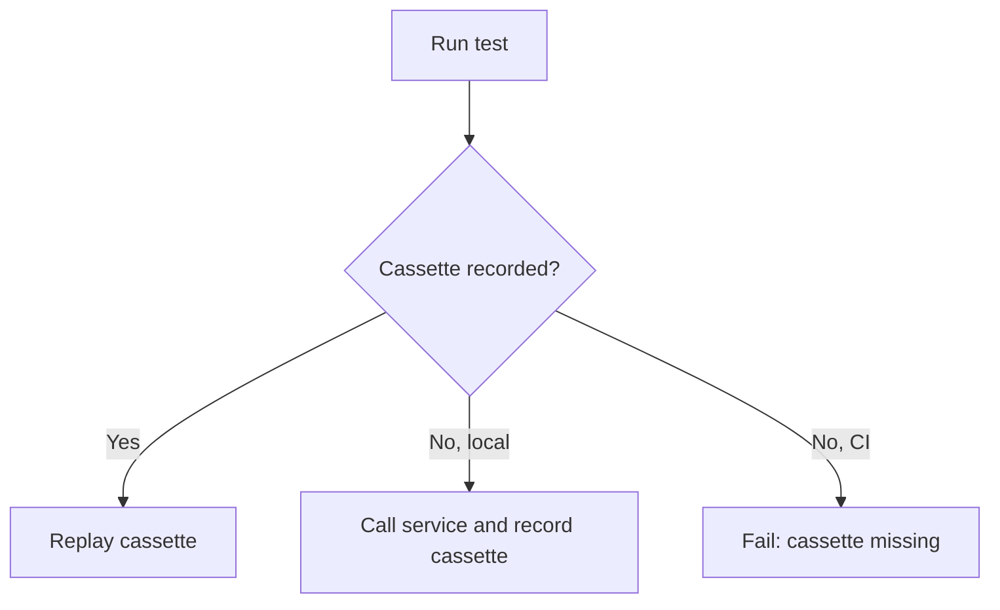

# @opencode-ai/http-recorder

Record real Effect HTTP and WebSocket traffic once, then replay it from deterministic JSON cassettes.

Use it for provider integrations, retries, polling, multi-step flows, and any test where hand-written HTTP mocks hide too much of the real request shape.

> Public beta. The API depends on Effect 4 beta and may change with Effect's unstable transport modules.

## Install

```sh
bun add effect@4.0.0-beta.83
bun add -d @opencode-ai/http-recorder @effect/vitest@4.0.0-beta.83 vitest@^4
```

The package supports Node.js 22+ and Bun. It is not intended for browsers, workers, or Deno.

Effect `4.0.0-beta.83` currently contains unresolved symbols in its published declarations. Until those upstream declarations are fixed, TypeScript consumers need:

```json
{
  "compilerOptions": {
    "skipLibCheck": true
  }
}
```

## Quick Start

```ts
import { assert, describe, it } from "@effect/vitest"
import { Effect, Schema } from "effect"
import { HttpClient, HttpClientRequest } from "effect/unstable/http"
import { HttpRecorder } from "@opencode-ai/http-recorder"

const User = Schema.Struct({
  id: Schema.Number,
  name: Schema.String,
})

const getUser = Effect.gen(function* () {
  const http = yield* HttpClient.HttpClient
  const response = yield* http.execute(HttpClientRequest.get("https://jsonplaceholder.typicode.com/users/1"))
  return yield* Schema.decodeUnknownEffect(User)(yield* response.json)
})

describe("getUser", () => {
  it.effect("loads a user", () =>
    Effect.gen(function* () {
      const user = yield* getUser

      assert.strictEqual(user.id, 1)
      assert.strictEqual(user.name, "Leanne Graham")
    }).pipe(Effect.provide(HttpRecorder.layerFetch("users/get-one"))),
  )
})
```

Run the test with Vitest. The first local run calls the real API and records:

```sh
bunx vitest run users.test.ts
```

```text
test/fixtures/recordings/users/get-one.json
```

Later runs replay that cassette without contacting the upstream server. When `CI=true`, missing cassettes fail instead of recording.



Application code does not need to know whether a response is live or replayed.

## API

```ts
HttpRecorder.layer(name, options?)
HttpRecorder.layerFetch(name, options?)
HttpRecorder.layerSocket(name, options?)
HttpRecorder.layerWebSocketConstructor(name, options?)
HttpRecorder.hasCassetteSync(name, options?)
HttpRecorder.removeCassetteSync(name, options?)
```

That is the complete runtime API. `layer` decorates an application-provided `HttpClient`; `layerFetch` is the convenience layer that supplies Effect's fetch client. `layerWebSocketConstructor` decorates Effect's `Socket.WebSocketConstructor`, recording every dynamically selected URL and protocol. `layerSocket` is the lower-level transport-neutral decorator for an application-provided `Socket.Socket`.

Use `hasCassetteSync` when registering fixture-gated tests. `removeCassetteSync` explicitly removes one cassette before a focused refresh; removing a missing cassette is a no-op. Both helpers use the same cassette-name validation and default directory as the recorder layers.

Use `layer` to record through another Effect HTTP transport:

```ts
import { NodeHttpClient } from "@effect/platform-node"
import { Layer } from "effect"

const recorder = HttpRecorder.layer("users/get-one").pipe(Layer.provide(NodeHttpClient.layerUndici))
```

The `HttpRecorder` namespace also exposes the configuration types `RecorderOptions`, `SocketRecorderOptions`, `RedactOptions`, `RequestMatcher`, `RequestSnapshot`, and `CassetteMetadata`.

## WebSockets

Real applications often select WebSocket URLs inside domain services. Effect represents that capability with `Socket.WebSocketConstructor`; production supplies the platform implementation, while tests can decorate it without changing application code.

```ts
import { NodeSocket } from "@effect/platform-node"
import { it } from "@effect/vitest"
import { Deferred, Effect, Layer } from "effect"
import { Socket } from "effect/unstable/socket"
import { HttpRecorder } from "@opencode-ai/http-recorder"

const roundTrip = Effect.fn("Echo.roundTrip")(function* (url: string, message: string) {
  const socket = yield* Socket.makeWebSocket(url, { closeCodeIsError: () => false })
  const write = yield* socket.writer
  const echoed = yield* Deferred.make<string>()

  yield* socket.runString(
    (response) => {
      return Deferred.succeed(echoed, response).pipe(
        Effect.andThen(write(new Socket.CloseEvent(1000, "done"))),
        Effect.orDie,
      )
    },
    { onOpen: write(message).pipe(Effect.orDie) },
  )

  return yield* Deferred.await(echoed)
})

it.effect("round trips a message", () =>
  roundTrip("wss://ws.postman-echo.com/raw", "hello").pipe(
    Effect.scoped,
    Effect.provide(
      HttpRecorder.layerWebSocketConstructor("echo/round-trip").pipe(
        Layer.provide(NodeSocket.layerWebSocketConstructor),
      ),
    ),
  ),
)
```

The production application supplies only `NodeSocket.layerWebSocketConstructor`. The recorder appears in test wiring and observes each call to `Socket.makeWebSocket`, including URLs selected at runtime.

`socket.runString` owns the receive loop and finishes when the connection closes or fails. Its optional `onOpen` effect is the safe place to send protocols whose client speaks first. The writer is scoped because sending is valid only while a connection run is active.

WebSocket cassettes preserve one ordered transcript of client and server text or binary frames. Replay releases recorded server frames until it reaches a client frame, waits for the application to write the matching frame, then continues. This preserves causal ordering without reproducing network timing.

Client text frames containing JSON compare canonically, so object-key order does not matter. Changed fields, extra fields, non-JSON text, and binary frames must match exactly after redaction. There is intentionally no custom WebSocket matcher in this beta.

Incoming frame handlers start in recorded order and may run concurrently, matching Effect's socket abstraction. Replay waits for all handlers before the socket run completes, but handler completion order is not guaranteed. Use Effect synchronization such as `Queue`, `Ref`, or `Deferred` instead of unsynchronized mutable state.

A constructor cassette records the URL, requested protocols, frames, and terminal close for each connection. Replay validates the URL and protocols before opening the simulated socket. Closing before every recorded frame is consumed fails the test.

Use `layerSocket` when a protocol layer already consumes one application-provided `Socket.Socket`, including non-WebSocket transports. Because that lower-level abstraction has no URL or protocols, its cassettes use the cassette name and connection order as identity.

Text frames use the same JSON-field and body redaction as HTTP bodies. Binary frames are stored losslessly as base64. Client and server frame kinds must match during replay.

## Refresh A Cassette

Delete exactly the recordings you want to replace, then rerun their tests:

```sh
rm test/fixtures/recordings/users/get-one.json
bun run test users.test.ts
```

There is intentionally no public overwrite mode. Deletion makes the set of recordings being refreshed visible and reviewable.

## Redaction

Secure defaults remove most headers and redact common credentials in headers, URLs, and JSON bodies. Extend those defaults at layer construction:

```ts
HttpRecorder.layerFetch("anthropic/messages", {
  redact: {
    headers: ["x-project-token"],
    allowRequestHeaders: ["anthropic-version"],
    queryParameters: ["session-id"],
    jsonFields: ["user_id"],
    url: (url) => url.replace(/\/accounts\/[^/]+/, "/accounts/{account}"),
    body: (body) => body.replaceAll(/usr_[a-z0-9]+/g, "usr_redacted"),
  },
})
```

| Option                 | Purpose                                                              |
| ---------------------- | -------------------------------------------------------------------- |
| `headers`              | Add sensitive header names. They are retained as `[REDACTED]`.       |
| `allowRequestHeaders`  | Preserve additional non-sensitive request headers for matching.      |
| `allowResponseHeaders` | Preserve additional non-sensitive response headers for replay.       |
| `queryParameters`      | Add sensitive URL query parameter names.                             |
| `jsonFields`           | Recursively redact matching JSON keys in requests and responses.     |
| `url`                  | Stabilize a URL after built-in redaction.                            |
| `body`                 | Stabilize request and response bodies after built-in JSON redaction. |

Before writing, the recorder scans the complete cassette for common credential formats and values from credential-like environment variables. Unsafe cassettes fail without replacing an existing recording.

Redaction is defense in depth, not a substitute for review. Inspect cassette diffs before committing them.

## Matching And Ordering

A runtime request atomically claims the first unused recorded interaction that matches it. Distinct requests may replay in any order or concurrently.

Repeated identical requests consume their matching responses in cassette order, which models retries, polling, and cache tests deterministically. A mismatch consumes nothing, and JSON object keys are canonicalized before matching.

Concurrent requests are recorded in request-start order even when their responses complete out of order. Each recorded interaction can be claimed only once, and leaving interactions unused fails when the recorder layer closes.

Supply a custom equivalence rule when a request contains intentionally volatile data:

```ts
HttpRecorder.layerFetch("events/create", {
  match: (incoming, recorded) =>
    incoming.method === recorded.method && new URL(incoming.url).pathname === new URL(recorded.url).pathname,
})
```

## Configuration

```ts
interface RecorderOptions {
  readonly directory?: string
  readonly metadata?: Readonly<Record<string, JsonValue>>
  readonly redact?: RedactOptions
  readonly match?: RequestMatcher
}

type SocketRecorderOptions = Omit<RecorderOptions, "match">
```

`directory` defaults to `<cwd>/test/fixtures/recordings`.

See [`examples/`](./examples) for complete HTTP and WebSocket examples.

## Cassettes

Cassettes are readable JSON files intended to be committed with your tests. HTTP interactions are stored in request order. WebSocket cassettes preserve the observed order of client and server frames. Text stays readable; binary bodies and frames are stored losslessly as base64.

## Current Limits

- Responses are buffered while recording and replaying, so this beta is not suitable for tests that assert streaming timing, cancellation, or backpressure.
- WebSocket replay preserves frame chronology and content, not real network timing or backpressure.
- Constructor-level WebSocket cassettes reproduce terminal close codes and reasons, but not selected subprotocols, handshake headers, transport timing, or transport failures. Lower-level `layerSocket` cassettes contain frames only.
- Failed and interrupted live WebSocket connections are not recorded.
- WebSocket transcripts are retained in memory until the connection finishes; avoid using this beta for unbounded sessions.
- The package currently requires the exact Effect beta listed above.
- Cassette format version `1` has no migration tooling yet.

## License

MIT
