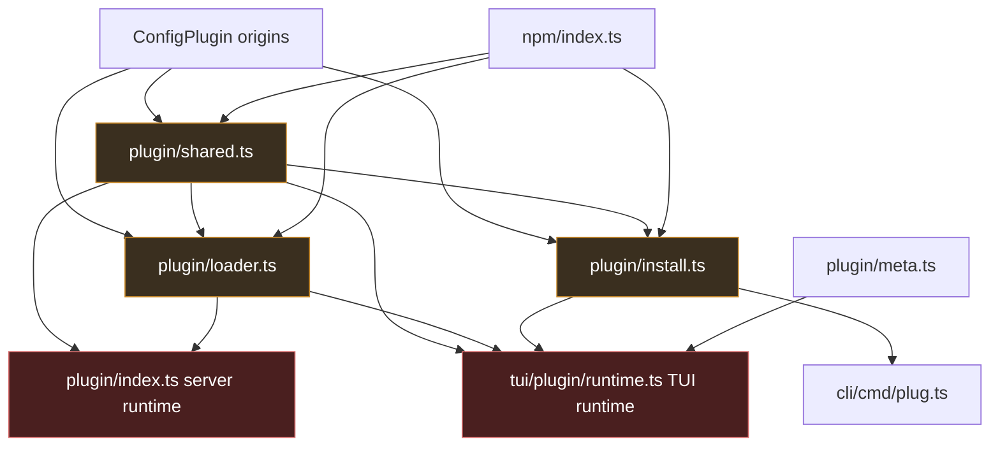
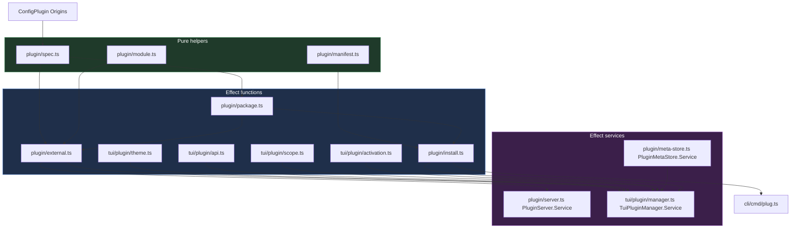
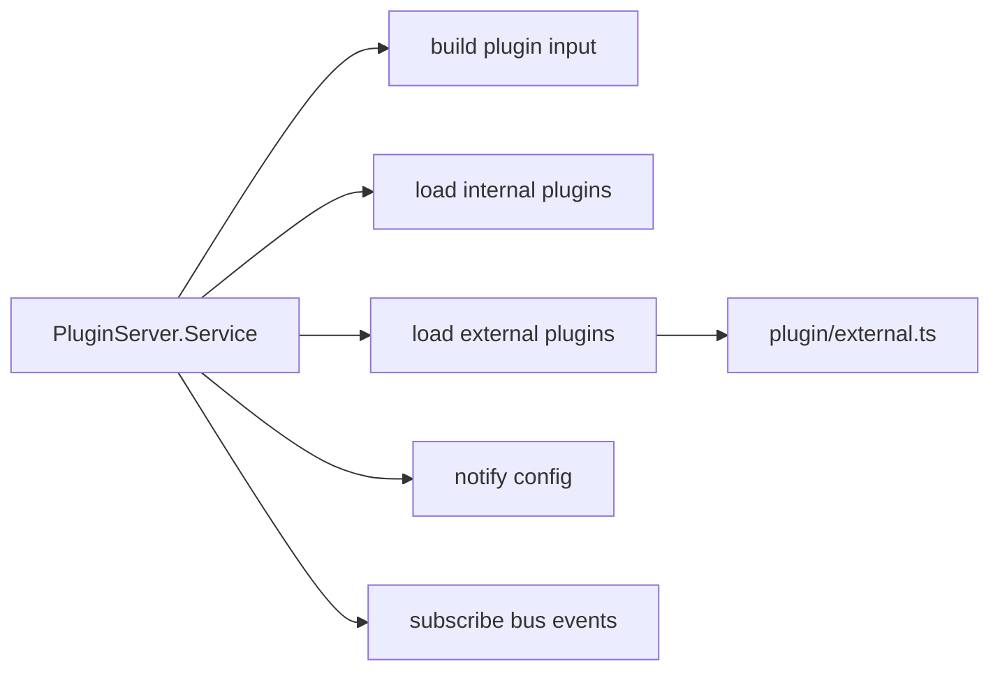
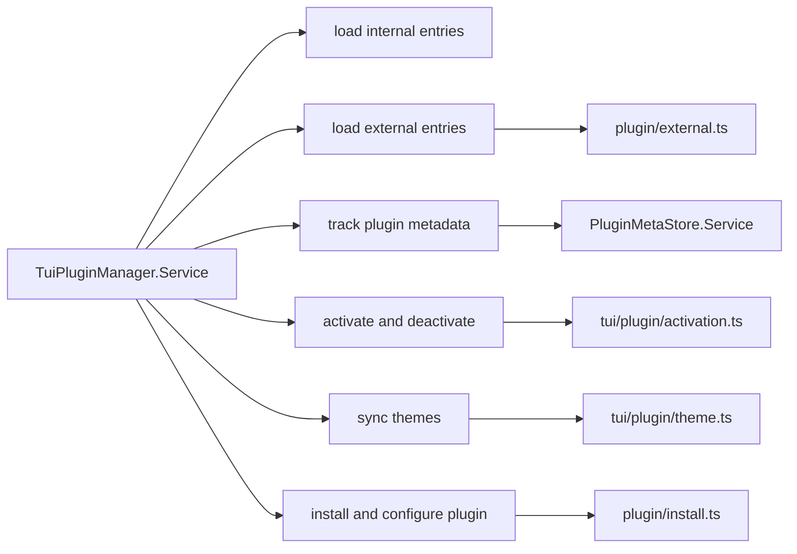

# Plugin architecture

This is a working note for reorganizing plugin code while the codebase migrates to Effect.

## Current shape

The main problem is that one conceptual system is split across a few large modules with overlapping responsibilities.

### What is mixed together today

- `src/plugin/shared.ts`
  spec parsing, package reading, entry resolution, compatibility checks, theme discovery, module validation, id resolution
- `src/plugin/loader.ts`
  plan building, target resolution, import, retry rules, reporting hooks
- `src/plugin/install.ts`
  install wrapper, manifest inspection, config patching, file locking
- `src/plugin/index.ts`
  server plugin runtime, hook loading, config fanout, event subscription
- `src/cli/cmd/tui/plugin/runtime.ts`
  TUI runtime state, loading, activation, API adaptation, theme sync, install flow, pending state, process singleton
- `src/plugin/meta.ts`
  file-backed mutable plugin metadata store

## Target shape

The redesign should split stateless plugin plumbing from stateful runtimes.

## Module boundaries

### Pure helpers

- `src/plugin/spec.ts`
  parse specifiers, detect npm vs file, normalize ids
- `src/plugin/module.ts`
  validate exported module shape, extract `id`, read v1 server or TUI modules
- `src/plugin/manifest.ts`
  derive package capabilities from package metadata

These should not touch the filesystem or global state.

### Effect functions

- `src/plugin/package.ts`
  read `package.json`, check compatibility, read theme files
- `src/plugin/external.ts`
  resolve targets, resolve entrypoints, import modules, retry local file plugins after dependency prep
- `src/plugin/install.ts`
  shared install and config-patch workflow used by CLI and TUI
- `src/cli/cmd/tui/plugin/theme.ts`
  sync and persist themes
- `src/cli/cmd/tui/plugin/api.ts`
  adapt host API to plugin API
- `src/cli/cmd/tui/plugin/scope.ts`
  lifecycle resource helpers
- `src/cli/cmd/tui/plugin/activation.ts`
  activate and deactivate one plugin entry

These are composable functions that return `Effect`, but do not own long-lived mutable state.

### Services

- `PluginMetaStore.Service`
  owns the metadata file and lock-backed updates
- `PluginServer.Service`
  owns loaded server hooks and bus subscription state per project/worktree via `InstanceState`
- `TuiPluginManager.Service`
  owns loaded TUI entries, enabled state, pending installs, and activation lifecycle

## Runtime split

### Server side

### TUI side

## Design rules

- Keep orchestration readable at the top level.
- Put state in services, not module globals.
- Prefer typed results over callback-driven reporting.
- Share install/configure workflow between CLI and TUI.
- Keep plugin discovery parallel, but keep activation and hook registration sequential.
- Preserve the special cases that already matter:
  theme-only TUI plugins, legacy server plugins, local file-plugin retry after dependency prep.

## Suggested migration order

1. Split `shared.ts` into `spec.ts`, `module.ts`, `manifest.ts`, and `package.ts` without changing behavior.
2. Replace `loader.ts` with flat exports in `external.ts` and return typed result values instead of report callbacks.
3. Collapse duplicated install flow into one shared `plugin/install.ts` workflow used by CLI and TUI.
4. Convert `meta.ts` into `PluginMetaStore.Service`.
5. Shrink `plugin/index.ts` into a thin `PluginServer.Service` composition root.
6. Break up `tui/plugin/runtime.ts` and move its mutable runtime state into `TuiPluginManager.Service`.
